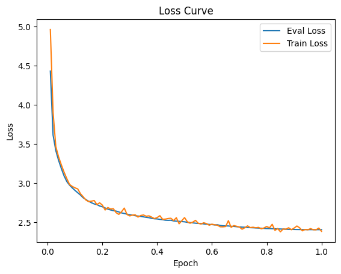

# ChatGLM-LoRA-medical: 基于中文医学知识的ChatGLM模型高效微调

[](https://github.com/SCIR-HI/Med-ChatGLM/blob/main/LICENSE)
[](https://www.python.org/downloads/release/python-3810/)

本项目开源了经过中文医学指令精调/指令微调(Instruct-tuning) 的ChatGLM-6B模型。使用[alpaca-cot](https://github.com/PhoebusSi/Alpaca-CoT) 、[ChatGLM-Med](https://github.com/SCIR-HI/Med-ChatGLM) 、[alpaca_chinese_dataset](https://github.com/hikariming/alpaca_chinese_dataset) 的数据集，并在此基础上对ChatGLM-6B进行了高效指令微调，提高了ChatGLM在医疗领域的问答效果。

## A Quick Start

这里主要参考的是GitHub上的一个项目[yuanzhoulvpi2017/zero_nlp](https://github.com/yuanzhoulvpi2017/zero_nlp)

首先安装依赖包，python环境建议3.8+

```
pip install -r requirements.txt
```

## 模型下载

训练好的各个checkpoint可以通过如下方式下载：

| 模型名称             |   大小   |                      模型下载地址                      |
| :------------------- | :------: | :----------------------------------------------------: |
| ChatGLM-LoRA-medical | 约2.13GB | [[阿里云网盘]](https://www.aliyundrive.com/s/NS4BBoJDyfF) |

## 交互式测试

在安装好环境后，即可进行交互式测试：

```
python infer.py
```

## 数据集构建

我选用了[alpaca-cot](https://github.com/PhoebusSi/Alpaca-CoT) 、[ChatGLM-Med](https://github.com/SCIR-HI/Med-ChatGLM) 、[alpaca_chinese_dataset](https://github.com/hikariming/alpaca_chinese_dataset) 的数据集来构造训练集和验证集。

```
sh scripts/generate_data.sh
```

请根据实际情况调整genrate_data_dir、target_dir_list等超参。

## Instruct-tuning 指令微调

### 下载ChatGLM-6B原始参数

请参照[https://github.com/THUDM/ChatGLM-6B](https://github.com/THUDM/ChatGLM-6B) ，并将下载的模型放入 `model`目录下。

这里我所使用到的是zero_nlp作者维护的一个chatGLM早期版本[thuglm6b-dddd](https://huggingface.co/yuanzhoulvpi/chatglm6b-dddd) 模型.

```
git clone https://huggingface.co/yuanzhoulvpi/chatglm6b-dddd
```

### 指令微调

```
sh scripts/finetune_ChatGLM.sh
```

请根据实际情况调整batch size等超参，默认为我们使用的参数。

### 计算资源需求

本人在一张A100-PCIE-40GB显卡上进行了训练。

## 模型效果



## 常见问题

1. Q: 模型效果有限

   A: 受限于计算资源等因素，训练数据集还相对较少，迭代次数也相对较低，这会对ChatGLM的基础能力带来负面影响，因而模型的效果较为有限。

## 致谢

本项目参考了以下开源项目，在此对相关项目和研究开发人员表示感谢。

- ChatGLM: [https://github.com/THUDM/ChatGLM-6B](https://github.com/THUDM/ChatGLM-6B)
- ChatGLM-Instruct-Tuning: [https://github.com/thinksoso/ChatGLM-Instruct-Tuning/issues](https://github.com/thinksoso/ChatGLM-Instruct-Tuning/issues)
- Med-ChatGLM:[https://github.com/SCIR-HI/Med-ChatGLM](https://github.com/SCIR-HI/Med-ChatGLM)
- zero-nlp:[https://github.com/yuanzhoulvpi2017/zero_nlp](https://github.com/yuanzhoulvpi2017/zero_nlp)

## 免责声明

本项目相关资源仅供学术研究之用，严禁用于商业用途。使用涉及第三方代码的部分时，请严格遵循相应的开源协议。模型生成的内容受模型计算、随机性和量化精度损失等因素影响，本项目无法对其准确性作出保证。本项目数据集绝大部分由模型生成，即使符合某些医学事实，也不能被用作实际医学诊断的依据。对于模型输出的任何内容，本项目不承担任何法律责任，亦不对因使用相关资源和输出结果而可能产生的任何损失承担责任。

## Citation

如果你使用了本项目的数据或者代码，请声明引用

```
@misc{ChatGLM-LoRA-medical,
  author={HuangChong Xuan},
  title = {ChatGLM-LoRA-medical: 基于中文医学知识的ChatGLM模型高效微调},
  year = {2023},
  publisher = {GitHub},
  journal = {GitHub repository},
  howpublished = {\url{https://github.com/ustbHCX/ChatGLM-Lora-medical}},
}
```
